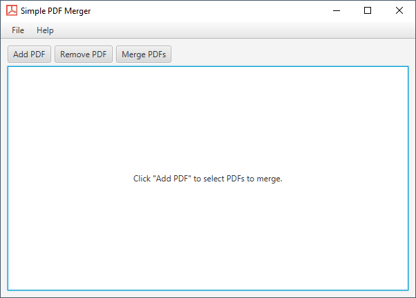
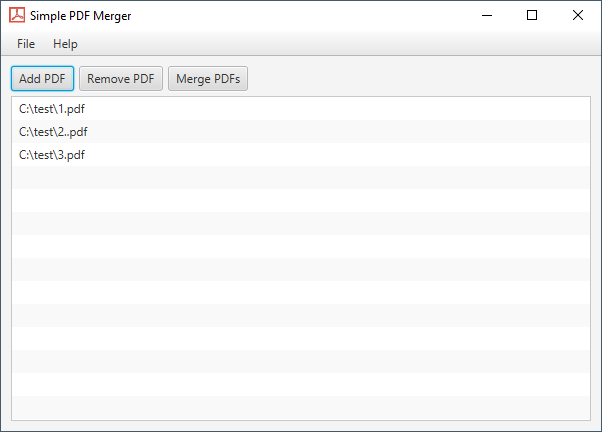

# Simple PDF Merger
### Extremely lightweight PDF merging program
Simple PDF Merger was written as a demonstration of the ease-of-use of the JavaFX framework for 
building desktop applications. Apache's PDFBox library does all the heavy lifting of actually
processing the PDFs.

### Features
- Simple PDF Merger facilitates merging multiple PDFs into one document.
- The entire program is in one file [PDFMerger.java](./src/main/java/com/dustinredmond/pdfmerger/PDFMerger.java) (yes, this is an awful practice)
- Simple PDF Merger can run on Linux, Windows, and MacOS

### Screenshots

- Main application screen

- PDFs queued to be merged

### Download and Installation

- A precompiled executable JAR file is included in the [dist](./dist) folder. If you have
JRE 8 installed, you should be able to download, double-click the JAR file, and run it.
- If you wish to build from source using Apache Maven, simply run `mvn clean package` 
from inside the repository root.

### Notes
 
If you liked this project feel free to give it a star or fork the repo. This project was meant
to be a simple demonstration about JavaFX's capabilities, but if you feel that you have something
to contribute to it that beginner JavaFX developers would appreciate, please submit a pull request.